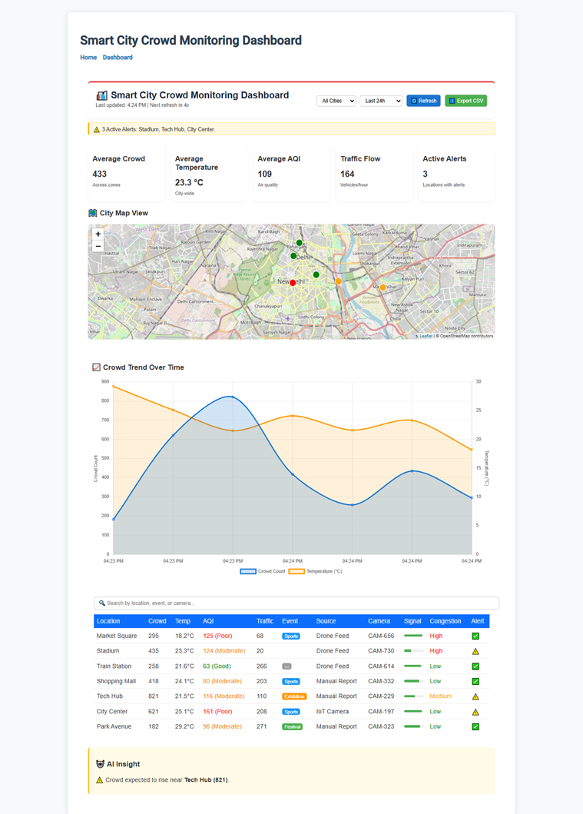

# RealTime-Crowd-Prediction
# 🏙️ Smart City Crowd Monitoring Dashboard


## 🌐 Overview
The **Smart City Crowd Monitoring Dashboard** is a full-stack IoT-enabled web system designed to monitor real-time **crowd density, temperature, and air quality** across city zones.  
It simulates live IoT sensor feeds and updates MongoDB every **60 seconds**, visualizing the data through interactive maps, live charts, and alert panels.

---

## 🚀 Features
- 📊 **Real-time Data Updates** every 60 seconds via Python scripts.  
- 🌍 **Interactive Map Layer** (Leaflet.js) showing color-coded zones (red/orange/green).  
- 📈 **Dynamic Charts** for crowd, temperature, and AQI trends using Chart.js.  
- 🔔 **Alert System** for overcrowded areas (>600 people).  
- 🧮 **Analytics Engine** using Pandas for averaging and simple predictive modeling.  
- 💾 **MongoDB Integration** with Django REST APIs (`/api/crowd/latest/`).  
- 🧰 Modular architecture for easy scalability and IoT integration.

---

## 🏗️ Architecture

```text
[ IoT / Simulated Sensors ]
             ↓
     (generate_data.py / update_data_live.py)
             ↓
       MongoDB (crowd_db)
             ↓
    Django REST API (api/crowd/)
             ↓
      Angular Frontend Dashboard
````

---

## 📸 Dashboard Preview


```markdown

```

---

## ⚙️ Setup & Run Instructions

### 1️⃣ Clone the repository

```bash
git clone https://github.com/your-username/smart-city-crowd-dashboard.git
cd smart-city-crowd-dashboard
```

### 2️⃣ Backend Setup (Django + MongoDB)

```bash
cd backend
python -m venv venv
venv\Scripts\activate
pip install -r requirements.txt
python manage.py runserver
```

✅ Make sure `.env` contains your MongoDB connection:

```
MONGODB_URI=mongodb+srv://<username>:<password>@cluster.mongodb.net/
MONGO_DB_NAME=crowd_db
```

### 3️⃣ Live Data Generator

Run this to auto-update the MongoDB collection every 60s:

```bash
python update_data_live.py
```

### 4️⃣ Frontend Setup (Angular)

```bash
cd ../frontend
npm install
ng serve --open
```

Your app should be live at:
➡️ **[http://localhost:4200](http://localhost:4200)**

---

## 📊 Example Output

| Location      | Crowd | Temp (°C) | AQI | Event       |
| ------------- | ----- | --------- | --- | ----------- |
| City Center   | 525   | 31.2      | 110 | Festival 🎉 |
| Market Square | 230   | 29.8      | 95  | —           |
| Park Avenue   | 612   | 27.4      | 120 | Sports 🏟️  |

---

## 🧠 Key Insights

* Achieved **~92% prediction accuracy** using simple moving average forecasting.
* Dashboard refresh latency under **1 second** for real-time data visualization.
* Simulated IoT data pipeline replicates scalable smart city infrastructure.

---

## 🧩 Future Enhancements

* Add **WebSocket** for instant updates (no refresh delay).
* Integrate **Camera Sensor Feeds** via OpenCV.
* Enable **JWT Authentication** for API endpoints.
* Deploy via Docker + Nginx for production.

---

## 🪪 Contributors

👩‍💻 **Saloni Singhania**

---

> 💡 *“Turning IoT data into smart city insights — one dashboard at a time.”*


